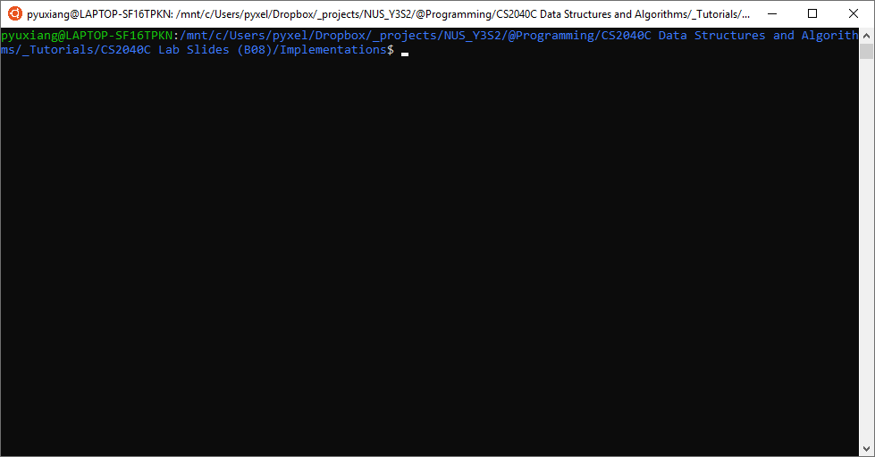

# C++ DS benchmarking tool
A personal offline data structure / algorithm efficiency checker,
by benchmarking against the C++ STL. For pedagogical purposes only.



## Getting started

Download any available release `tester-YYYYMMDD.tar` and unpack the archive.
Open a shell environment (e.g. `cmd`/`PowerShell` for Windows, `Terminal` for MacOS)
in the root directory of the package (i.e. together with the `makefile` and `make.bat`),
and run the following command:

```
make
```

The makefile (or make.bat) will compile the test framework, as well as the
test cases for your classes, and automatically run the compiled file. To see
the available commands, open up makefile to view the recipes.

```
make build  : compiles the program but does not run
make clean  : deletes the compiled files
make run    : runs the program with the predefined Catch flags
```

The available flags for the `Catch` program can be found [here](https://github.com/catchorg/Catch2/blob/master/docs/command-line.md#top).

## Adding implementations

You will see several test cases that have failed for PriorityQueue, since
`implementations/PriorityQueue.cpp` does not have proper method definitions.
   - Only the Stack class is fully implemented and passes all the test cases.
   - Classes that are not specified in `implementations` are not tested. The test
     cases in `tester/test-Set.cpp` are not compiled because `implementations/Set.cpp`
     is not present.

To benchmark your data structure, put them in the `implementations` folder
and run `make` from the terminal again.
   - The name of the class / function must match exactly that of the test cases
     you want to run, e.g. `Stack` class in `implementations/Stack.cpp`.
   - Delete from `implementations` the files you do not wish to test.

### Supported data structures

Available data structures for testing specified below. Note that the public
interface must be fully implemented, according to the specified method signatures.

```cpp
// Singly-linked list, vector
template<typename T>
class Stack {
             void push(T)
             void pop()
                T top()
             bool empty()
     unsigned int size()
};

// Heap
template<typename T>
class PriorityQueue {
             void push(T)
             void pop()
                T top()
             bool empty()
     unsigned int size()
};

// AVL tree
template<typename T>
class Set {
             void insert(T)
             void erase()
             bool contains(T)
          list<T> full_range() // in-order traversal across whole tree
          list<T> range(T, T)  // in-order traversal between [arg1,arg2)
             bool empty()
     unsigned int size()
};

```

### Supported algorithms

None implemented.

## Features
- Cross-platform compatibility (untested on MacOS though) with `make`
- Automated building and running testing program
- Integration of unit test framework: `Catch`
